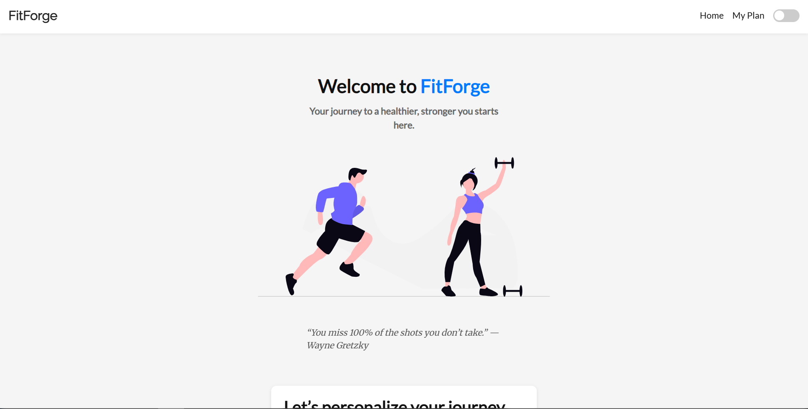
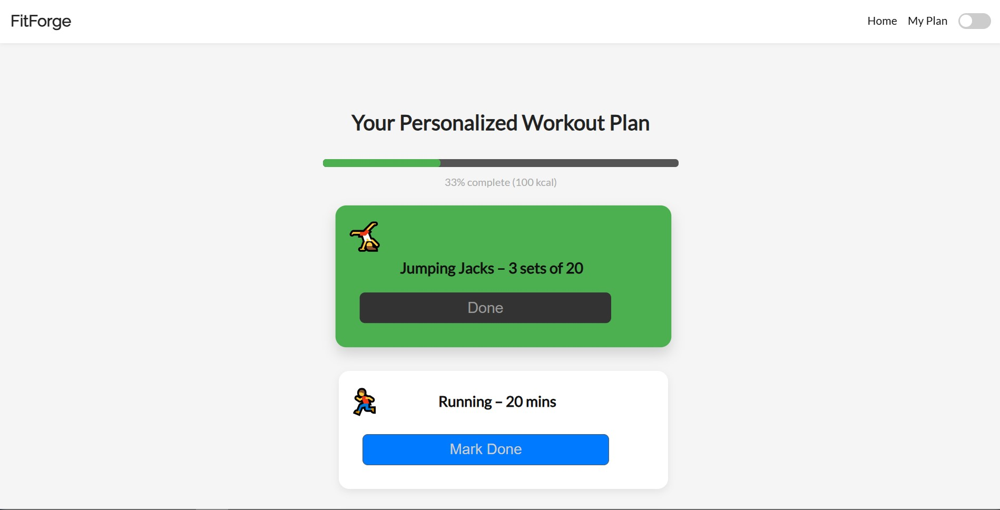
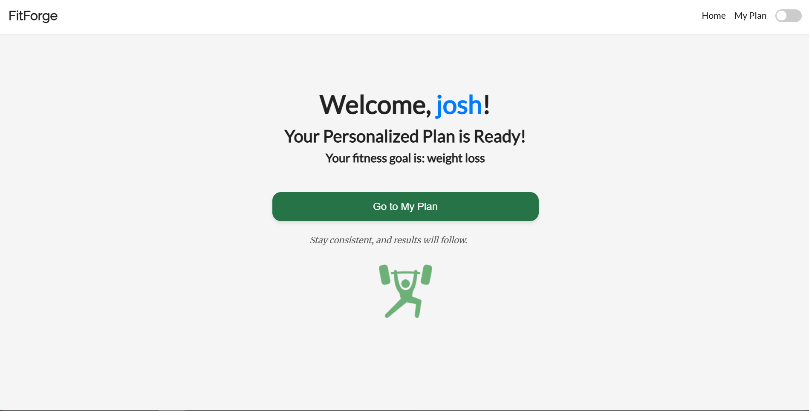
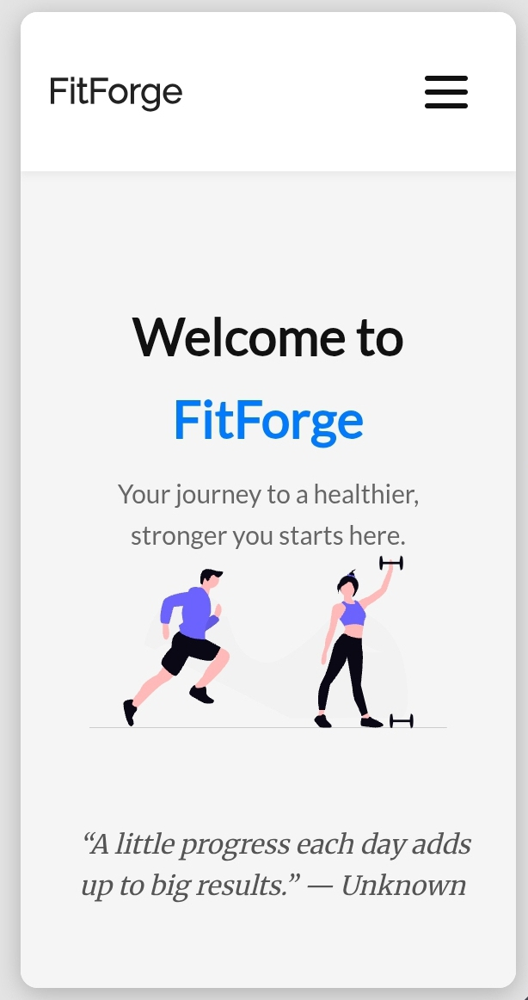
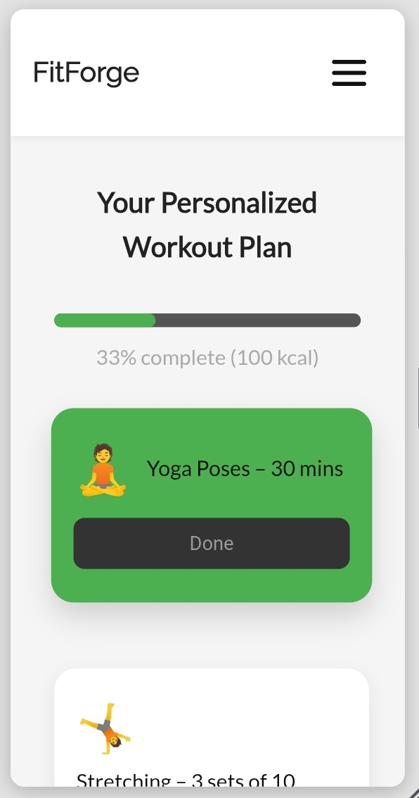
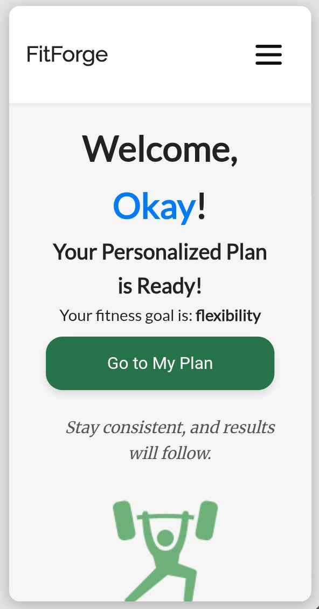

# FitForge - Fitness Tracker Web App

**FitForge** is a beginner-friendly fitness tracker web app built using HTML, CSS, and JavaScript. It was developed as a capstone project for Unizik Blockchain Lab (UBL) Bootcamp, marking the successful completion of phase one focused on Web Development.

---

## Table of contents

- [Overview](#overview)
  - [The challenge](#the-challenge)
  - [About UBL](#about-ubl)
  - [Screenshots](#screenshots)
  - [What's Inside](#whats-inside)
  - [Links](#links)
- [My process](#my-process)
  - [Built with](#built-with)
  - [What I learned](#what-i-learned)
- [What's Next](#whats-next)
- [Special Thanks](#special-thanks)
- [Author](#author)

---

## Overview

### The challenge

As part of the Unizik Blockchain Lab (UBL) Bootcamp, we were tasked with building a capstone project of our choice — one that applies and extends the concepts we've learned in Web Development so far. While UBL provided recommended ideas and feature suggestions (such as using localStorage, dark/light mode toggles, and working with APIs), we were also encouraged to pursue our own ideas as long as they demonstrated practical use of core web technologies.

I chose to build **FitForge**, a lightweight yet functional fitness tracker app. It was designed to help users set fitness goals, generate personalized workout plans, and track their progress — all while allowing me to deepen my understanding of HTML, CSS, and JavaScript.

---

## About UBL

Unizik Blockchain Lab (UBL) is an innovative tech initiative focused on training and mentoring developers in blockchain and decentralized technologies. The bootcamp helps participants build strong foundational skills in Web 2 development while guiding them toward mastery of Web 3 concepts, empowering a new generation of developers to build the future of decentralized applications.

---

### Screenshots

#### Desktop

  
  

#### Mobile

  
  

---

## What's Inside

1. Enter your nickname and select a fitness goal on the home page.
2. Get a personalized workout plan on the confirmation screen.
3. Track and mark exercises as done on the workout page.
4. Progress is saved automatically and you can resume incomplete workouts anytime.
5. Completed workout days are marked on the calendar for easy tracking.
6. Toggle between light and dark mode for a comfortable viewing experience.

---

### Links

- Live Website: [https://yourgithubusername.github.io/fitforge/](https://codecblvck.github.io/fitness-tracker/)
- Repository: [https://github.com/yourgithubusername/fitforge](https://github.com/Codecblvck/fitness-tracker.git)

---

## My process

### Built with

- HTML5
- CSS3 (including animations and responsive design)
- Vanilla JavaScript
- `localStorage` API for persistent data

### What I learned

- How to create a stateful web app with progress persistence using `localStorage`.
- Managing UI state dynamically based on user interactions.
- Implementing a workout calendar and tracking completion per day and per fitness goal.
- Creating a smooth user experience with motivational messages and progress bars.
- Structuring a real-world capstone project from idea to deployment.

---

## What's Next

To expand on this project and deepen my understanding of advanced web development concepts, I plan to implement the following in the future:

- **External API Integration**:

  - Fetch motivational quotes using a public API instead of static local data.
  - Generate personalized workout plans dynamically from a fitness API.

- **Smart Plan Progression**:

  - Save the user's initial fitness goal and create fresh workouts daily.
  - Eliminate the need to reselect the goal every session.
  - Ensure no workout feels repetitive by fetching new data per day.

- **Authentication & User Management**:

  - Add login/signup to allow multiple users to track their own progress.
  - Secure data storage for logs and goals per user.

- **Framework Upgrade**:
  - Rebuild the app using a JavaScript framework like **React** or **Next.js** for better scalability and performance.

For now, I’m proud to have built this using just HTML, CSS, and JavaScript. I'm excited to continue learning and improving it. Thank you to everyone who helped me along the way!

---

## Special Thanks

- **UBL Bootcamps** — for providing the learning path and project inspiration.
- **Donscrript** — my tutor, for the guidance, encouragement, and mentorship throughout this project.

---

## Author

Made with passion and discipline by **Codec-Bkvck**.

- **LinkedIn**: [Raphael M. Somtochukwu](https://www.linkedin.com/in/raphael-m-somtochkwu-47086332b)
- **Twitter**: [@Codec_blvck](https://x.com/Codec_blvck)
